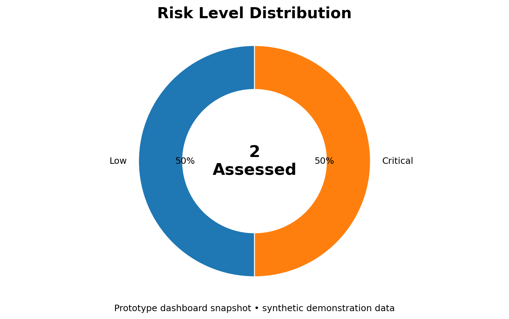
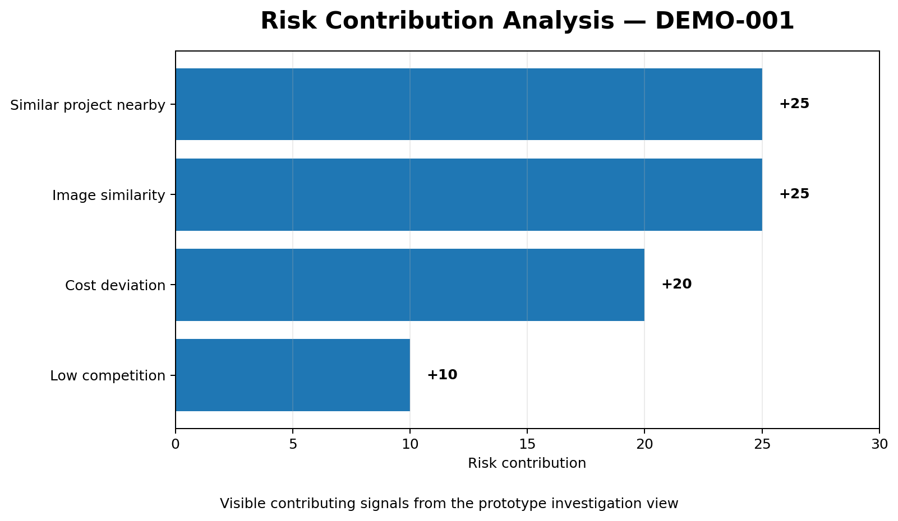
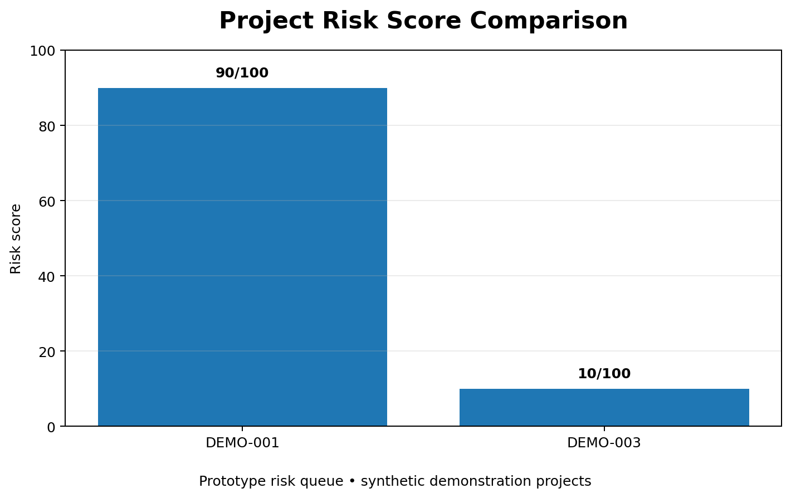
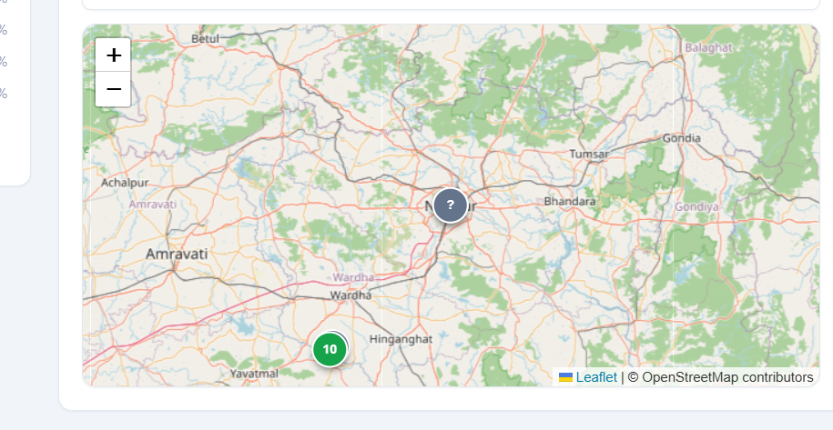
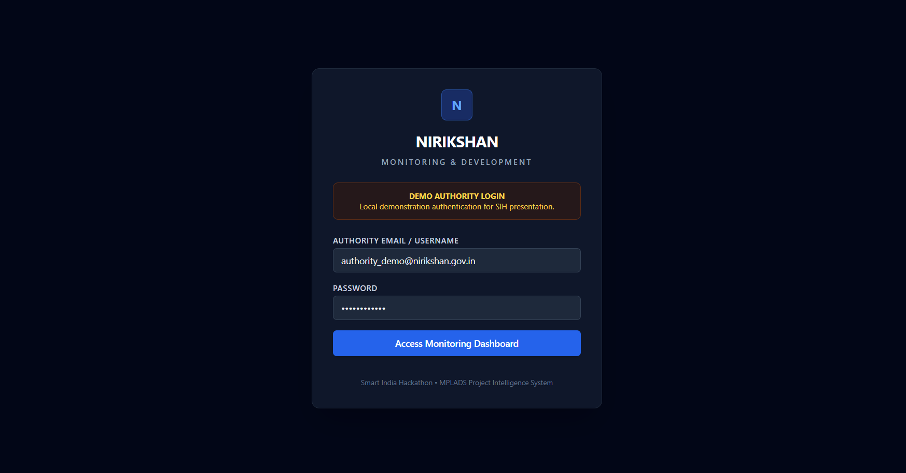
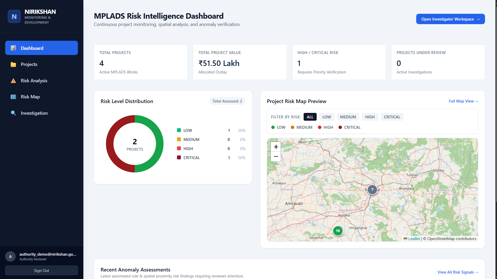
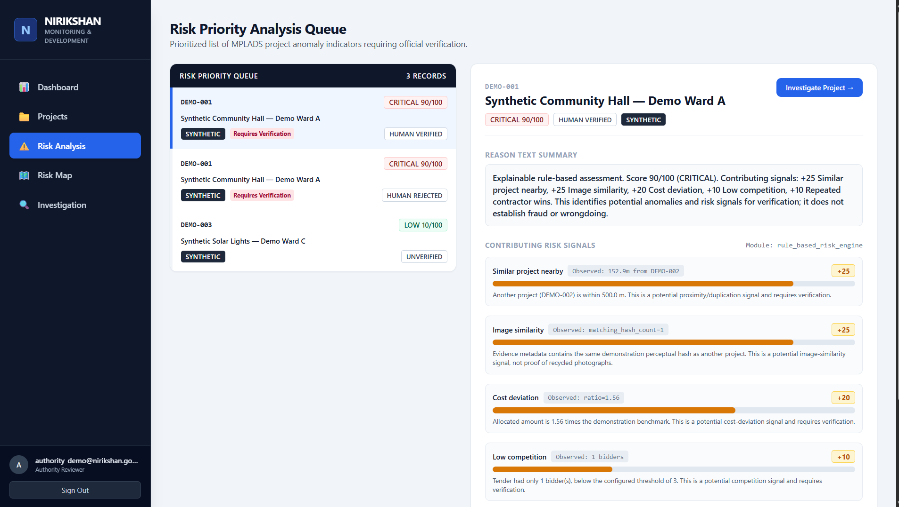
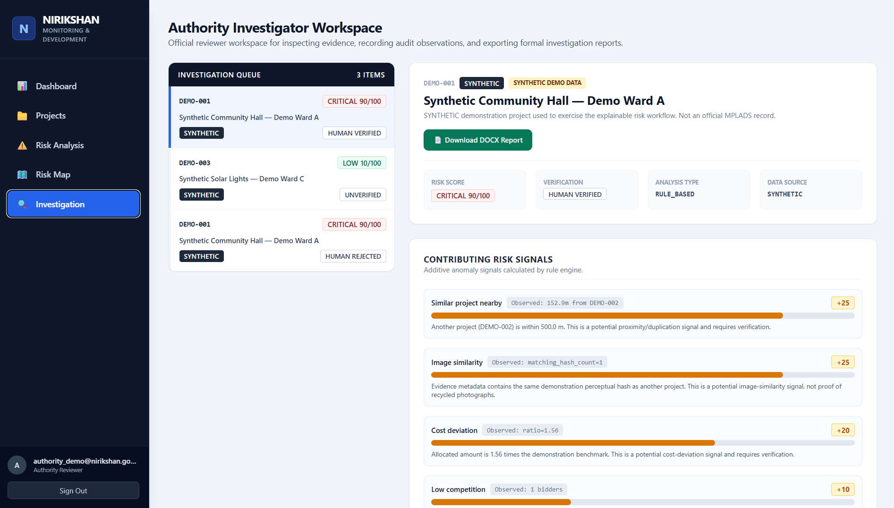

# NIRIKSHAN — MPLADS Risk Intelligence & Monitoring System

> **AI-assisted project monitoring, spatial analysis, anomaly detection, and evidence-based verification for MPLADS implementation.**

NIRIKSHAN is a monitoring and risk-intelligence prototype designed to help authorities prioritize MPLADS projects that require verification. The system combines project data, spatial relationships, cost signals, tender/competition indicators, image-evidence similarity, and explainable rule-based risk scoring to surface projects for human review.

> **Demo note:** The current prototype uses synthetic demonstration data. Risk signals are indicators for verification and **do not by themselves establish fraud or wrongdoing**.

---

## 🎯 Problem

Monitoring large numbers of development projects manually can make it difficult to identify which projects deserve immediate attention.

NIRIKSHAN provides a centralized workflow to:

- monitor project-level risk,
- prioritize anomalies for verification,
- visualize projects geographically,
- explain why a project received a risk score,
- inspect supporting evidence,
- record human verification outcomes, and
- generate investigation reports.

---

## 💡 Solution

NIRIKSHAN follows an **explainable, human-in-the-loop** approach:

```text
Project & Evidence Data
          │
          ├── Spatial Analysis
          ├── Cost Deviation
          ├── Tender / Competition Signals
          ├── Image Similarity Signals
          └── Other Rule-Based Indicators
                    │
                    ▼
          Explainable Risk Engine
                    │
                    ▼
             Risk Score / Level
                    │
        ┌───────────┴───────────┐
        ▼                       ▼
 Risk Analysis Queue      Risk Map
        │                       │
        └───────────┬───────────┘
                    ▼
        Authority Investigation
                    │
                    ▼
       Human Verification / Audit
                    │
                    ▼
          Investigation Report
```

---

# 📊 Data Visualizations

The README includes **actual chart/graph visualizations based on values visible in the current prototype UI**, rather than only using screenshots.

### 1. Risk Level Distribution

The dashboard currently shows 2 assessed projects: **1 Low (50%)** and **1 Critical (50%)**.



### 2. Risk Contribution Analysis

The prototype explains the DEMO-001 risk assessment through individual contributing signals visible in the investigation interface.



### 3. Project Risk Score Comparison

The current prototype queue visibly contains DEMO-001 with a **90/100** risk score and DEMO-003 with a **10/100** risk score.



### 4. Geographic Risk Visualization

The dashboard provides a map-based visualization of project locations and risk information.



> **Important:** These are prototype visualizations using synthetic demonstration data. They are included to demonstrate the application's analytical and visualization capabilities.

---

# ✨ Key Features

## 📊 Risk Intelligence Dashboard

A centralized overview of monitored projects with:

- total projects,
- total project value,
- high/critical-risk projects,
- projects under review,
- risk-level distribution,
- project risk map preview, and
- recent anomaly assessments.

## ⚠️ Explainable Risk Analysis

Projects are prioritized using contributing signals rather than an unexplained black-box score.

Example signals demonstrated in the prototype:

- **Similar project nearby**
- **Image similarity**
- **Cost deviation**
- **Low tender competition**

Each signal can show its observed value, explanation, and contribution to the overall assessment.

## 🗺️ Geospatial Risk Mapping

The system provides a map-based view of projects with risk filtering for:

- Low
- Medium
- High
- Critical

The prototype uses **Leaflet with OpenStreetMap** map data.

## 🔎 Authority Investigation Workspace

Authorized reviewers can:

- open prioritized projects,
- inspect risk signals,
- view verification status,
- inspect evidence metadata,
- record human verification outcomes, and
- export an investigation report.

## 🧾 Evidence & Provenance

The interface distinguishes synthetic demonstration data and verification states to support an auditable workflow.

## 🧠 Human-in-the-Loop Verification

NIRIKSHAN does not automatically declare fraud. It identifies **potential risk/anomaly signals** and routes them to an authority for verification.

---

# 🖥️ Prototype Screenshots

## Authority Login



The prototype provides a dedicated authority login screen for accessing the monitoring and investigation workflow.

## Risk Intelligence Dashboard



The dashboard provides an at-a-glance view of project volume, project value, risk distribution, geographic risk, and recent anomaly assessments.

## Risk Priority Analysis



The risk analysis queue prioritizes projects and explains the contributing signals behind each risk score.

## Authority Investigation Workspace



The investigation workspace allows reviewers to inspect evidence, review risk signals, record verification outcomes, and export investigation reports.

---

# 🧩 Technology Stack

| Layer | Technologies |
|---|---|
| Frontend | React, TypeScript, Vite, Tailwind CSS |
| UI / Visualization | React components, charts, Leaflet maps |
| Backend | Python, FastAPI |
| Database | PostgreSQL, PostGIS |
| ORM / Data Layer | SQLAlchemy |
| Migrations | Alembic |
| Risk Engine | Explainable rule-based risk scoring |
| Geospatial | PostGIS, GIS service, Leaflet, OpenStreetMap |
| Evidence / Image Processing | Python image-processing services and similarity metadata |
| Testing | Pytest, frontend UI tests |
| Containers | Docker, Docker Compose |
| Automation | GitHub Actions |
| Configuration | YAML / environment-based configuration |

---

# 🤖 Intelligence Layer

The current Phase 1 prototype emphasizes **explainable rule-based risk assessment** so that every flagged project can be traced back to understandable signals.

The repository also contains dedicated modules for future/extended intelligence capabilities:

```text
ml/
├── anomaly_detection/
├── computer_vision/
└── nlp/
```

These provide an extensible foundation for:

- anomaly detection,
- computer vision,
- document/text analysis, and
- additional ML-based project intelligence.

The prototype intentionally keeps the reviewer in the loop rather than presenting an automated risk signal as proof of misconduct.

---

# 🗺️ GIS & Spatial Intelligence

NIRIKSHAN's GIS layer supports:

- project coordinates,
- proximity analysis,
- nearby-project signals,
- map-based filtering, and
- spatial risk visualization.

The backend includes a dedicated GIS service, while the frontend provides interactive map visualization.

---

# 🏗️ System Architecture

```text
┌─────────────────────────────────────────────┐
│              NIRIKSHAN FRONTEND             │
│ React + TypeScript + Vite + Tailwind CSS    │
│ Dashboard │ Risk Analysis │ Map │           │
│ Investigation │ Projects                    │
└──────────────────────┬──────────────────────┘
                       │ REST API
                       ▼
┌─────────────────────────────────────────────┐
│               FASTAPI BACKEND                │
│ Routers │ Services │ Risk Engine │ Auth     │
│ GIS │ Image Processing │ Cost Analysis      │
│ Tender Analysis │ Nexus / Relationship      │
└──────────────────────┬──────────────────────┘
                       │
                       ▼
┌─────────────────────────────────────────────┐
│          POSTGRESQL + POSTGIS               │
│ Project Data │ Risk Data │ Evidence         │
│ Spatial Data │ Verification / Audit Data    │
└─────────────────────────────────────────────┘
```

---

# 📁 Project Structure

```text
NIRIKSHAN-SIH-2026/
│
├── .github/workflows/
├── backend/
├── config/
├── data/
├── database/
├── docs/
├── frontend/
├── ml/
├── scripts/
├── tests/
├── docker-compose.yml
├── Makefile
├── .dockerignore
├── .gitignore
└── README.md
```

---

# 🔐 Security & Data Handling

The repository is configured to keep sensitive/local configuration out of source control.

The `.gitignore` excludes items such as:

```text
.env
.env.local
.venv/
venv/
__pycache__/
node_modules/
postgres_data/
uploads/
```

A `.env.example` file documents required environment variables without exposing local secrets.

> Never commit real API keys, database passwords, tokens, or other credentials.

---

# 🐳 Running the Prototype

### Prerequisites

- Git
- Docker Desktop
- Docker Compose

### Clone

```bash
git clone https://github.com/NeonParth/NIRIKSHAN-SIH-2026.git
cd NIRIKSHAN-SIH-2026
```

### Environment

```bash
copy .env.example .env
```

Configure the required local values in `.env`.

### Start services

```bash
docker compose up -d
```

The frontend can then be accessed through the configured local frontend port.

---

# 🧪 Testing

Backend tests:

```bash
cd backend
pytest
```

Frontend tests are configured in the frontend project.

CI configuration:

```text
.github/workflows/ci.yml
```

---

# 📚 Documentation

Additional technical documentation is available under:

```text
docs/
├── API.md
├── DATA_MODEL.md
├── DEVELOPMENT.md
├── PROJECT_ARCHITECTURE.md
└── RISK_ENGINE.md
```

---

# 🚀 Future Scope

Potential extensions include:

- stronger ML-based anomaly detection,
- advanced computer-vision evidence comparison,
- NLP-based document analysis,
- automated cross-project relationship discovery,
- richer GIS/spatial analytics,
- external data-source integration,
- advanced audit trails,
- role-based access control,
- model monitoring and evaluation, and
- production deployment.

---

# ⚠️ Prototype Disclaimer

NIRIKSHAN is an SIH prototype demonstrating a risk-intelligence and verification workflow.

The prototype's risk scores identify **potential anomalies or risk signals requiring verification**. They should not be interpreted as automatic proof of fraud, corruption, or wrongdoing.

The current demonstration uses synthetic data.

---

# 👥 Team

**NIRIKSHAN — SIH 2026**

Team collaboration and individual contribution details can be added as the project moves into the collaborative development phase.

---

## 📌 Repository

**NIRIKSHAN-SIH-2026**

The repository contains the frontend, backend, database, GIS, risk-engine, ML module structure, tests, documentation, Docker configuration, CI workflow, and README visualizations for the prototype.
